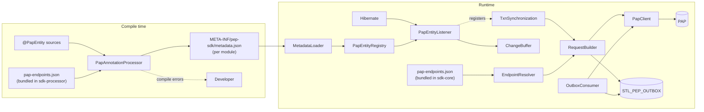
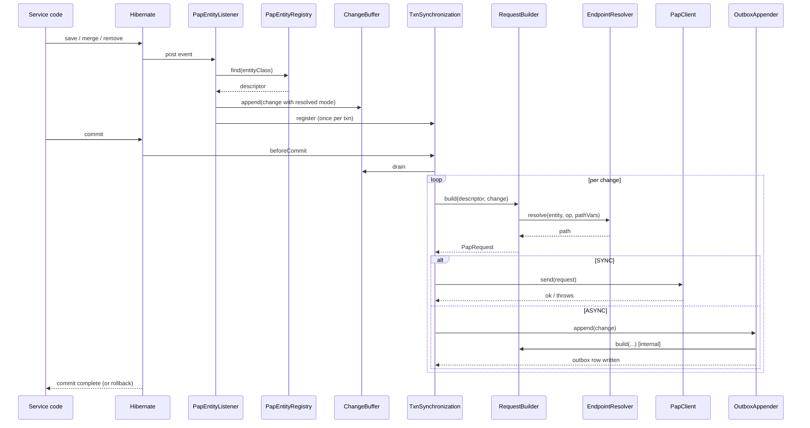
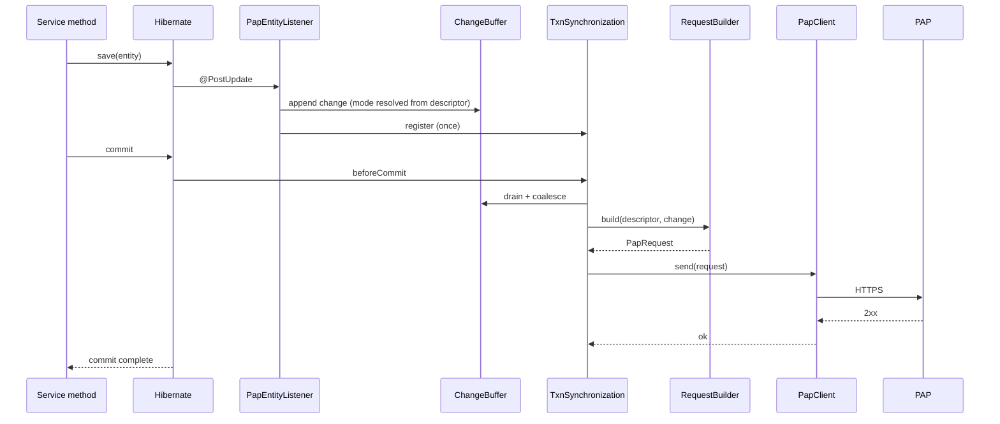
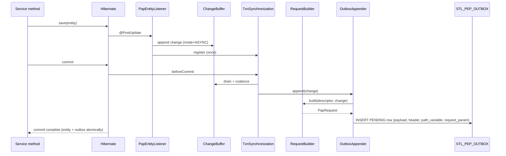
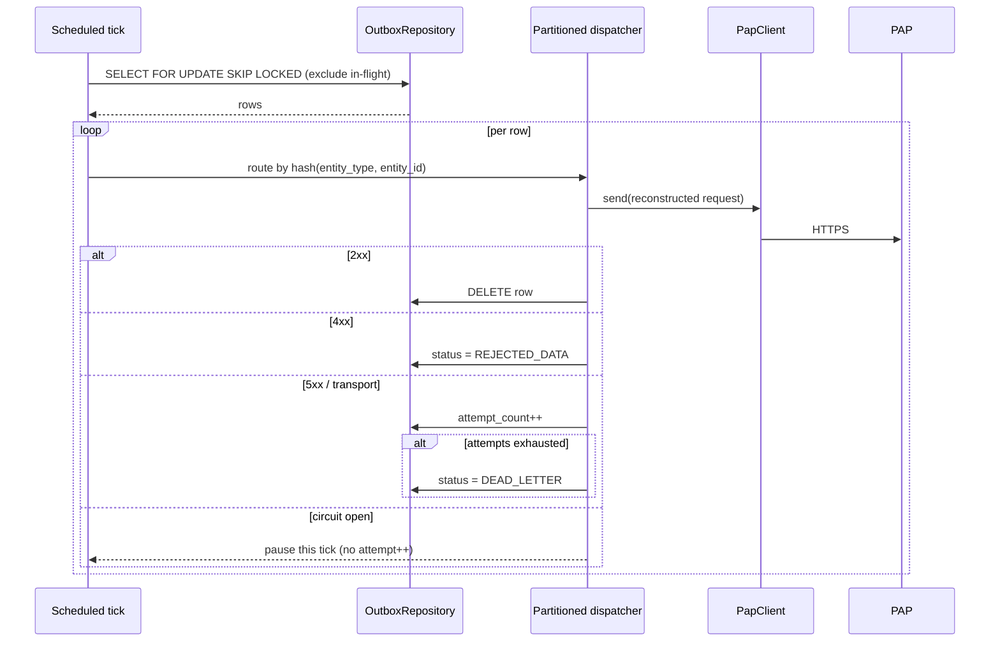
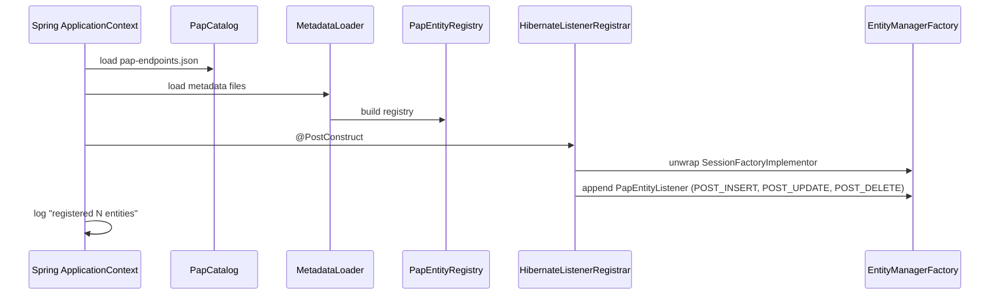
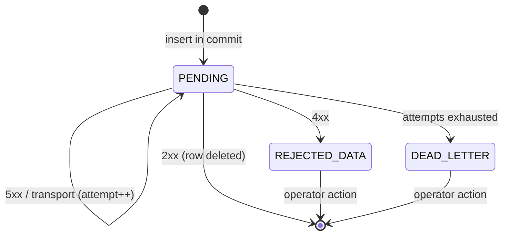

# PEP SDK — Design Document

## 1. Introduction

### 1.1 Purpose

The PEP SDK is a Java/Spring Boot library that synchronizes JPA-managed entity changes to a remote Policy Administration Point (PAP). It removes the transport, retry, circuit-breaking, request construction, and outbox-based recovery code that would otherwise be repeated in every service that integrates with the PAP.

The developer's only contract with the SDK is **annotations on JPA entities**. The developer does not call the PAP, does not configure URLs, does not write listener wiring, and does not annotate service methods. Everything happens between the entity and the database transaction.

The SDK operates in two phases:

- **Compile time.** An annotation processor inspects `@PapEntity` declarations, validates them against the SDK's bundled PAP catalog, and generates a metadata descriptor file per module.
- **Runtime.** At startup, the SDK loads all metadata descriptors on the classpath, builds the entity registry, and registers a Hibernate event listener. From then on, every persist / update / delete on a `@PapEntity` flows through the SDK to the PAP, in whichever mode the entity declared for that operation.

### 1.2 Audience

Engineers implementing the SDK, and engineers maintaining services that consume it. Sections 3 and 6 are useful to a service developer; sections 4, 5, and 7 are for SDK implementers and reviewers.

### 1.3 Related documents

- The SDK specification (separate doc) defines the external contract. Where this document and the spec overlap, the spec is authoritative for *what* and this document is authoritative for *how*.

## 2. Requirements

### 2.1 Functional Requirements

| ID | Requirement |
|---|---|
| F-1 | The SDK shall capture CREATE/UPDATE/DELETE operations on JPA entities annotated with `@PapEntity` and propagate them to the PAP. |
| F-2 | The communication mode for each operation shall be declared per entity in `@PapEntity.operationModes`. |
| F-3 | The SDK shall validate `@PapEntity` declarations at compile time against the bundled PAP catalog, failing the build on invalid declarations. |
| F-4 | The annotation processor shall generate a metadata descriptor file (`META-INF/pep-sdk/metadata.json`) per module containing the resolved descriptors used at runtime. |
| F-5 | The SDK shall preset all PAP endpoint URLs based on entity type and operation; URLs shall not be configurable by the developer. |
| F-6 | The SDK shall propagate per-entity static properties (e.g., `tenant_id`, `topic_id`) declared on `@PapEntity.properties` on every request. |
| F-7 | In SYNC mode, a PAP rejection or unavailability after retries shall cause the service's DB transaction to roll back. |
| F-8 | In ASYNC mode, the entity change and the outbox row shall be committed atomically. |
| F-9 | The SDK shall preserve causal ordering of changes per `(entity_type, entity_id)`. |
| F-10 | Service application methods, repositories, and controllers shall not require any SDK annotation. |
| F-11 | The developer shall not invoke the PAP directly; all PAP communication is performed by the SDK. |

### 2.2 Non-Functional Requirements

| ID | Requirement |
|---|---|
| N-1 | The service application shall remain available when the PAP is unreachable, in ASYNC mode. |
| N-2 | Startup shall not require runtime classpath scanning; the registry shall be built from generated metadata files alone. |
| N-3 | Multiple JVM instances of the service may run concurrently; the SDK shall behave correctly under this assumption. |
| N-4 | All exceptions raised by the SDK shall carry enough context (entity type, entity id, operation, attempt count) to diagnose without re-running the failure. |
| N-5 | The annotation processor shall add no runtime dependencies to the consuming application. |

### 2.3 Out of Scope

- Rolling back service state when ASYNC dispatch is rejected by the PAP.
- Initial reconciliation between an existing service database and the PAP.
- Idempotency-based deduplication on the SDK side. The PAP does not support `Idempotency-Key`.
- Non-JPA persistence; non-HTTP transports.
- Cross-entity transactional guarantees on the PAP side.
- Developer-configured PAP endpoints. URLs are baked into the SDK catalog.

### 2.4 Assumptions and Dependencies

- The service uses Spring Boot with JPA/Hibernate.
- The service DB supports `SELECT ... FOR UPDATE SKIP LOCKED` (PostgreSQL 9.5+, MySQL 8.0+, Oracle 19c+).
- The SDK ships with an up-to-date `pap-endpoints.json` catalog matching the PAP's current API.
- The PAP performs natural deduplication on writes — e.g., by treating CREATE-with-existing-id as UPDATE — since retries from the SDK have no idempotency token to leverage.

## 3. Integration Guide

The developer's full integration story. Anything not in this section is internal.

### 3.1 Dependencies

Runtime:

```xml
<dependency>
  <groupId>com.example.pep</groupId>
  <artifactId>sdk-spring-boot-starter</artifactId>
  <version>${pep-sdk.version}</version>
</dependency>
```

Compile-time only (the annotation processor):

```xml
<plugin>
  <artifactId>maven-compiler-plugin</artifactId>
  <configuration>
    <annotationProcessorPaths>
      <path>
        <groupId>com.example.pep</groupId>
        <artifactId>sdk-processor</artifactId>
        <version>${pep-sdk.version}</version>
      </path>
    </annotationProcessorPaths>
  </configuration>
</plugin>
```

Run the bundled Flyway migration that creates `STL_PEP_OUTBOX` (required for any ASYNC operation).

### 3.2 Annotating an entity

```java
@Entity
@PapEntity(
    entity = "ResourceInstance",
    properties = {
        @PapProperty(key = "tenant_id", value = "1"),
        @PapProperty(key = "topic_id",  value = "POLICY")
    },
    operationModes = {
        @PapOperationMode(operation = Operation.CREATE, mode = CommunicationMode.SYNC),
        @PapOperationMode(operation = Operation.UPDATE, mode = CommunicationMode.SYNC),
        @PapOperationMode(operation = Operation.DELETE, mode = CommunicationMode.ASYNC)
    }
)
public class Pipeline {

    @Id
    @PapAttribute(attributeName = "id")
    private UUID id;

    @PapAttribute(attributeName = "code")
    private String code;

    @PapAttribute(attributeName = "name")
    private String name;

    @PapAttribute(attributeName = "description")
    private String description;
}
```

That is the complete integration on the entity side. Service classes, repositories, and controllers carry **no SDK annotations**.

### 3.3 Compile-time output

When `mvn compile` runs:

1. The processor validates each `@PapEntity`:
   - `entity` is present in the bundled catalog.
   - Every required attribute for that PAP entity (per the catalog) has a corresponding `@PapAttribute`.
   - The class has an `@Id` field with `@PapAttribute`.
2. The processor writes `target/classes/META-INF/pep-sdk/metadata.json` for the current module.

Sample failure output:

```
[ERROR] Pipeline @ src/main/java/.../Pipeline.java:12
  - entity "Pipeleen" is not in the PAP catalog
    (known: ResourceInstance, Policy, Tenant, Topic, ...)
  - required attribute 'code' has no @PapAttribute mapping on Pipeline
  - class has no field annotated @Id
```

### 3.4 Runtime startup

On startup the SDK:

1. Reads every `META-INF/pep-sdk/metadata.json` on the classpath.
2. Merges them into the registry.
3. Attaches `PapEntityListener` to Hibernate via `EventListenerRegistry`.
4. Logs the registered entities:

```
PEP SDK : loaded 2 metadata files (4 entities)
  Pipeline -> ResourceInstance [C:SYNC U:SYNC D:ASYNC]
  Policy   -> Policy           [C:SYNC U:ASYNC D:ASYNC]
  ...
```

### 3.5 Configuration

`application.yml`:

```yaml
pap:
  sdk:
    base-url: https://pap.internal.example.com   # required
    retry:
      max-attempts: 3
    circuit-breaker:
      failure-rate-threshold: 50
    outbox:
      poll-interval: 1s
      batch-size: 50
      max-attempts: 10
```

There is no `mode` property — mode is per-operation on the entity. There is no `base-package` property — the registry is built from generated metadata. There is no URL configuration — the catalog owns URLs.

### 3.6 Authentication

The SDK ships no default auth. Provide a `PapRequestDecorator` bean:

```java
@Bean
PapRequestDecorator authDecorator(TokenProvider tokens) {
    return (headers, request) -> headers.set("Authorization", "Bearer " + tokens.current());
}
```

The decorator runs once per dispatch, just before the HTTP call.

### 3.7 Operating the outbox

Standard SQL inspection of `STL_PEP_OUTBOX`:

```sql
SELECT status, count(*) FROM STL_PEP_OUTBOX GROUP BY status;

SELECT * FROM STL_PEP_OUTBOX
 WHERE status = 'PENDING'
   AND created_at < now() - interval '5 minutes';

SELECT entity_type, count(*) FROM STL_PEP_OUTBOX
 WHERE status IN ('REJECTED_DATA', 'DEAD_LETTER')
 GROUP BY entity_type;
```

Re-queue by setting `status = 'PENDING'` and `attempt_count = 0` after the underlying issue has been fixed.

### 3.8 Testing

- Unit tests: `pap.sdk.enabled=false` in the test profile.
- Integration tests: WireMock or a test container as the fake PAP; point `pap.sdk.base-url` at it.

## 4. System Architecture

### 4.1 Two-phase architecture



Both phases share the catalog (`pap-endpoints.json`). The processor uses it to validate; the runtime uses it to resolve URLs.

### 4.2 Responsibilities at a glance

| Component | Phase | Responsibility |
|---|---|---|
| `PapAnnotationProcessor` | compile | Validate `@PapEntity` against the catalog; emit `metadata.json`. |
| `PapCatalog` | both | Read `pap-endpoints.json`; list known PAP types and their endpoints / required attributes. |
| `MetadataLoader` | runtime | Read all `metadata.json` files from the classpath; build the registry. |
| `PapEntityRegistry` | runtime | Immutable map of entity class → descriptor. |
| `EndpointResolver` | runtime | Compute PAP URL from `papEntity` + operation + path variables. |
| `PapEntityListener` | runtime | Hibernate post-event hook; captures changes, buffers them. |
| `ChangeBuffer` | runtime | Transaction-scoped accumulator with last-write-wins coalescing. |
| `PapTransactionSynchronization` | runtime | At `beforeCommit`, drain buffer; route each change SYNC vs ASYNC based on its descriptor. |
| `PapRequestBuilder` | runtime | Build the request shape (`headers`, `payload`, `path_variable`, `request_param`). |
| `PapClient` | runtime | Resilience4j-wrapped HTTP transport. |
| `PapOutboxConsumer` | runtime | Scheduled poller; partitioned dispatcher; status transitions. |

### 4.3 Module map

| Module | Depends on | Contains |
|---|---|---|
| `sdk-core` | — | Annotations, model types, `PapCatalog`, `EndpointResolver`, `MetadataLoader`, `PapEntityRegistry`, request types, exceptions. |
| `sdk-processor` | `sdk-core` | `PapAnnotationProcessor`, `PapValidator`, `MetadataWriter`. Compile-time only — never on a runtime classpath. |
| `sdk-client` | `sdk-core` | `PapClient` (Resilience4j + RestClient), `PapRequestDecorator` SPI. |
| `sdk-sync` | `sdk-core`, `sdk-client` | `PapTransactionSynchronization`, `ChangeBuffer`, `OutboxAppender` SPI. |
| `sdk-async` | `sdk-core`, `sdk-client`, `sdk-sync` | `PapOutboxEntry`, `PapOutboxRepository`, `DefaultOutboxAppender`, `PapOutboxConsumer`, Flyway migration. |
| `sdk-spring-boot-starter` | all of the above | Auto-config, properties binding, Hibernate listener registrar. |

### 4.4 Catalog distribution

`pap-endpoints.json` is bundled in **both** `sdk-core` (used at runtime by `EndpointResolver`) and `sdk-processor` (used at compile time by the validator). Both modules read the same file; the SDK build keeps them in lock-step.

Each catalog entry:

```json
{
  "ResourceInstance": {
    "createPath": "/api/v1/resourceInstances",
    "updatePath": "/api/v1/resourceInstances/{id}",
    "deletePath": "/api/v1/resourceInstances/{id}",
    "bulkPath": "/api/v1/resourceInstances/_bulk",
    "requiredAttributes": ["id", "code", "name"]
  }
}
```

Path placeholders are resolved from the request's `path_variable` map.

## 5. Module Design

Implementation-level detail per module.

### 5.1 sdk-core

**Purpose.** Shared kernel. Annotations live here so the processor and the runtime can both reference them.

**Key classes:**

- Annotations: `@PapEntity`, `@PapProperty`, `@PapOperationMode`, `@PapAttribute`.
- Enums: `Operation` (CREATE / UPDATE / DELETE), `CommunicationMode` (SYNC / ASYNC), `OutboxStatus` (PENDING / REJECTED_DATA / DEAD_LETTER), `HttpMethod`.
- Catalog: `PapCatalog`, `EndpointSpec` (record).
- Resolver: `EndpointResolver`.
- Model: `PapEntityChange` (record), `PapEntityDescriptor`, `AttributeAccessor`.
- Loader: `MetadataLoader`, `PapEntityRegistry`.
- Request: `PapRequest` (record), `PapRequestBuilder`.
- Exceptions: `PapException`, `PapRejectedException`, `PapUnavailableException`, `PapSdkException`.

**Internal mechanics:**

- `PapCatalog` reads `META-INF/pep-sdk/pap-endpoints.json` once, lazily.
- `MetadataLoader` reads every `META-INF/pep-sdk/metadata.json` resource on the classpath. Each module contributes its own file; aggregation is by union. Conflicts (same entity class declared in multiple files) fail startup.
- `PapEntityDescriptor.modeFor(Operation)` returns the declared mode, defaulting to `SYNC` if the operation is not listed.
- `EndpointResolver` substitutes `{name}` placeholders in path templates from the request's `path_variable` map. Missing variables fail fast.

### 5.2 sdk-processor

**Purpose.** Compile-time validation and metadata generation. No runtime presence.

**Key classes:**

- `PapAnnotationProcessor` — extends `javax.annotation.processing.AbstractProcessor`. Registered via `META-INF/services/javax.annotation.processing.Processor`.
- `PapValidator` — encapsulates validation rules; uses `javax.lang.model` (compile-time model, not reflection).
- `MetadataWriter` — assembles the JSON output, writes via `Filer.createResource(StandardLocation.CLASS_OUTPUT, ...)`.

**Internal mechanics:**

- Loads the bundled catalog from its own classpath once per build.
- For each `@PapEntity`-annotated `TypeElement`:
  - Reads `entity`, `properties`, `operationModes`, attributes.
  - Looks up the catalog entry. If absent, emits an error.
  - Checks every catalog-required attribute is mapped by some `@PapAttribute` on the type. Missing → error.
  - Checks there is exactly one field annotated `@Id` and that it also has `@PapAttribute`. Missing → error.
- Accumulates valid descriptors across rounds; flushes on `processingOver()` to a single `metadata.json`.
- Errors use `Messager.printMessage(Diagnostic.Kind.ERROR, message, element)` so the IDE and Maven both show source-location-aware errors.

**Implementation note.** `@Id` is detected by simple name match (matches both `jakarta.persistence.Id` and `javax.persistence.Id`). This keeps the processor free of a hard JPA dependency.

### 5.3 sdk-client

**Purpose.** Transport boundary.

**Key classes:**

- `PapClient` — public entry point. One method: `send(PapRequest)`.
- `PapRequestDecorator` — SPI for header injection (auth, custom routing).

**Internal mechanics:**

- Single shared `RestClient` instance built at startup.
- Single `Retry` and `CircuitBreaker` instance, also shared.
- Order of decoration (innermost outward): RestClient call → Retry → CircuitBreaker.
- Headers assembled per request from: descriptor's `properties` (already in `PapRequest.header`), Content-Type, then decorator chain.
- **No idempotency key** is set. The PAP does not support deduplication; the SDK does not pretend to.

### 5.4 sdk-sync

**Purpose.** SYNC-mode dispatch via Spring's `TransactionSynchronization`.

**Key classes:**

- `ChangeBuffer` — transaction-scoped accumulator (see §9.4 for coalescing).
- `PapTransactionSynchronization` — implements `TransactionSynchronization`. Drains in `beforeCommit`.
- `OutboxAppender` — SPI. Implemented by `sdk-async`. Keeps this module free of a JPA dependency.

**Internal mechanics:**

- The synchronization is registered the first time the listener captures a change in a transaction (via `TransactionSynchronizationManager.registerSynchronization`).
- `beforeCommit(readOnly)` drains the buffer:
  1. Coalesce by `(entity_class, entity_id)` per §9.4.
  2. For each net change, look up its mode in the descriptor.
  3. Dispatch:
     - SYNC → invoke `PapClient`. Failure throws → Spring rolls back the transaction.
     - ASYNC → invoke `OutboxAppender`. The outbox insert participates in the same DB transaction.
- `afterCompletion` unbinds the buffer from `TransactionSynchronizationManager` regardless of outcome.

### 5.5 sdk-async

**Purpose.** Outbox-based eventual-consistency path.

**Key classes:**

- `PapOutboxEntry` — JPA entity for `STL_PEP_OUTBOX`.
- `PapOutboxRepository` — Spring Data JPA, native query for `FOR UPDATE SKIP LOCKED`.
- `DefaultOutboxAppender` — implements `OutboxAppender`; serializes the request shape into the row.
- `PapOutboxConsumer` — scheduled poller and partitioned dispatcher.

**Internal mechanics:**

- The appender stores the **fully-built request shape** (`payload`, `header`, `path_variable`, `request_param`) so the consumer dispatches with no further lookup. This decouples the consumer from the registry at dispatch time.
- The consumer's selection query:

  ```sql
  SELECT * FROM STL_PEP_OUTBOX
   WHERE status = 'PENDING'
     AND (entity_type || '|' || id) NOT IN (:inFlightKeys)
   ORDER BY created_at
   LIMIT :batchSize
   FOR UPDATE SKIP LOCKED
  ```

- Causal ordering is preserved by hashing `(entity_type, entity_id)` to a worker and excluding in-flight keys from subsequent claims. Note: `entity_id` is not in the schema as a separate column, but it can be extracted from `path_variable` or stored alongside. **Open issue:** see §13.
- On `CallNotPermittedException` (circuit open), the consumer pauses for the rest of the tick and **does not increment `attempt_count`**. Other failures increment; reaching `outbox.max-attempts` transitions the row to `DEAD_LETTER`.

### 5.6 sdk-spring-boot-starter

**Purpose.** Wire everything for a Spring Boot app.

**Key classes:**

- `PapSdkProperties` — bound from `pap.sdk.*`.
- `PapEntityListener` — Hibernate post-event listener.
- `HibernateListenerRegistrar` — registers the listener after the `EntityManagerFactory` is built.
- `Resilience4jFactory` — builds `Retry` and `CircuitBreaker` from properties.
- `PapSdkAutoConfiguration` — the wiring class.

**Internal mechanics:**

- Auto-configuration is gated by `@ConditionalOnProperty(name = "pap.sdk.enabled", havingValue = "true", matchIfMissing = true)`.
- `@EntityScan(basePackageClasses = PapOutboxEntry.class)` and `@EnableJpaRepositories(basePackageClasses = PapOutboxRepository.class)` make the outbox table visible without requiring the consuming app to do anything.
- The outbox consumer is scheduled via `@Scheduled(fixedDelayString = "${pap.sdk.outbox.poll-interval:1s}")` on a small wrapper class so the consumer itself stays free of Spring scheduling annotations.
- **No `@PapMode` advice** — there is nothing to advise on. Mode is purely a function of `(entity_class, operation)`.

## 6. API Design — Annotations

The SDK exposes four annotations. All four go on entities or entity fields. No annotation exists for service methods.

### 6.1 `@PapEntity`

Marks a JPA entity as mirroring a PAP entity. Required on the class.

```java
@Target(ElementType.TYPE)
@Retention(RetentionPolicy.RUNTIME)
public @interface PapEntity {
    String entity();
    PapProperty[] properties() default {};
    PapOperationMode[] operationModes() default {};
}
```

**Attribute reference:**

| # | Property | Type | Mandatory | Description |
|---|---|---|---|---|
| 1 | `entity` | `String` | Y | The PAP entity type this class mirrors. Validated at compile time against the bundled catalog. |
| 2 | `properties` | `PapProperty[]` | N | Static metadata propagated on every request for this entity. Each entry has `key` and `value`. Default: empty. |
| 3 | `operationModes` | `PapOperationMode[]` | N | Per-operation communication mode. Operations not listed default to `SYNC`. Default: empty. |

> **Java annotation constraint.** Annotations cannot have `Map` member types, so `properties` and `operationModes` are arrays of nested annotations. Semantically they are key→value maps; the SDK builds the maps from the arrays at startup. Duplicate keys in `properties` and duplicate operations in `operationModes` fail compilation.

**Usage:**

```java
@Entity
@PapEntity(
    entity = "ResourceInstance",
    properties = {
        @PapProperty(key = "tenant_id", value = "1"),
        @PapProperty(key = "topic_id",  value = "POLICY")
    },
    operationModes = {
        @PapOperationMode(operation = Operation.CREATE, mode = CommunicationMode.SYNC),
        @PapOperationMode(operation = Operation.UPDATE, mode = CommunicationMode.SYNC),
        @PapOperationMode(operation = Operation.DELETE, mode = CommunicationMode.ASYNC)
    }
)
public class Pipeline { ... }
```

**Compile-time effect.** `entity = "ResourceInstance"` is checked against the catalog. The required attributes for `ResourceInstance` must all be mapped by `@PapAttribute` on this class. If `operationModes` lists the same operation twice, compilation fails.

**Runtime effect.**
- A CREATE on `Pipeline` runs SYNC (PAP call in `beforeCommit`; rollback on failure).
- An UPDATE runs SYNC.
- A DELETE writes a `PENDING` outbox row; the consumer dispatches eventually.
- Every PAP request carries `tenant_id: 1` and `topic_id: POLICY` as headers (see §9.5 for property routing).

### 6.2 `@PapProperty`

A single static key→value pair carried with every request for the owning entity.

```java
@Target({})  // only usable inside @PapEntity
@Retention(RetentionPolicy.RUNTIME)
public @interface PapProperty {
    String key();
    String value();
}
```

**Attribute reference:**

| Property | Type | Mandatory | Description |
|---|---|---|---|
| `key` | `String` | Y | The property name. |
| `value` | `String` | Y | The property value. Always a string (annotation constraint). Numeric or boolean values must be stringified. |

**Default routing.** Properties become **HTTP headers** on every request for the entity. `tenant_id` → header `tenant_id: 1`. The PAP must accept these. Per-property routing (header vs query vs path) is currently not configurable; see §13.

### 6.3 `@PapOperationMode`

Declares the communication mode for one operation on the owning entity.

```java
@Target({})  // only usable inside @PapEntity
@Retention(RetentionPolicy.RUNTIME)
public @interface PapOperationMode {
    Operation operation();
    CommunicationMode mode();
}
```

| Property | Type | Mandatory | Description |
|---|---|---|---|
| `operation` | `Operation` | Y | One of CREATE, UPDATE, DELETE. |
| `mode` | `CommunicationMode` | Y | SYNC or ASYNC. |

Operations not listed in `@PapEntity.operationModes` default to `SYNC`. Listing the same operation twice is a compile error.

### 6.4 `@PapAttribute`

Maps a service-entity field to a PAP attribute. One per field that participates in PAP communication.

```java
@Target(ElementType.FIELD)
@Retention(RetentionPolicy.RUNTIME)
public @interface PapAttribute {
    String attributeName();
}
```

| # | Property | Type | Mandatory | Description |
|---|---|---|---|---|
| 1 | `attributeName` | `String` | Y | The PAP-side attribute name this field maps to. Used as the JSON key in the request payload. |

**Usage:**

```java
@Id
@PapAttribute(attributeName = "id")
private UUID id;

@PapAttribute(attributeName = "displayName")
private String name;
```

**Compile-time effect.** The processor verifies that every required PAP attribute (per the catalog) has a corresponding `@PapAttribute` somewhere on the class. `id` (the field also marked `@Id`) becomes the path-variable value for UPDATE and DELETE.

**Runtime effect.** The field's value is read reflectively at capture time and placed in `payload` under the key `attributeName`.

### 6.5 What is deliberately not an annotation

| Concept | Why no annotation |
|---|---|
| Method-level mode | Mode is on the entity per the spec. Service methods are untouched. |
| URL / endpoint path | The SDK ships a catalog; URLs are not developer-configurable. |
| HTTP method per operation | Determined by the catalog (POST for CREATE, PATCH for UPDATE, DELETE for DELETE). |
| Idempotency key | The PAP does not support it. |
| `@Id` | Use JPA's `@Id`. The SDK detects it by simple-name match. |

## 7. Class Reference

Each class's purpose, who calls it, and what it calls.

### 7.1 Compile-time classes (`sdk-processor`)

**`PapAnnotationProcessor`**
- Activated by `javac` when it sees `@PapEntity` in sources.
- Reads the bundled catalog once.
- For each annotated type element, delegates validation to `PapValidator` and descriptor building to an internal collector.
- On `processingOver()`, hands the collected descriptors to `MetadataWriter`.
- Errors are reported via `Messager`; the build fails.

**`PapValidator`**
- Pure functions over `javax.lang.model` types. No class loading, no reflection.
- Validation rules: entity in catalog; all required attributes mapped; exactly one `@Id` field; that `@Id` field is also annotated with `@PapAttribute`; no duplicate keys in `properties`; no duplicate operations in `operationModes`.
- Returns a list of diagnostics. The processor emits them in source order.

**`MetadataWriter`**
- Single responsibility: serialize the collected descriptors to a `metadata.json` file via `Filer`.
- Hand-rolled JSON (no Jackson dependency at processor time).

### 7.2 Runtime classes (`sdk-core`)

**`PapCatalog`**
- Reads `META-INF/pep-sdk/pap-endpoints.json` from its own classpath.
- Exposes: `Set<String> knownEntities()`, `EndpointSpec endpointFor(String papEntity)`, `List<String> requiredAttributes(String papEntity)`.
- Singleton; loaded once on first access.
- Consumers: `EndpointResolver` at runtime; `PapAnnotationProcessor` at compile time (separately loaded).

**`EndpointSpec`** (record)
- `(createPath, updatePath, deletePath, bulkPath, requiredAttributes)`.

**`EndpointResolver`**
- Stateless. Given `(papEntity, operation, pathVariables)`, returns the resolved path.
- Substitutes `{name}` placeholders from `pathVariables`.
- Throws `PapSdkException` if a placeholder is unfilled.
- Called by `PapRequestBuilder` and by the outbox consumer when rebuilding the URL on dispatch (though the consumer prefers the stored request shape — see §5.5).

**`MetadataLoader`**
- On startup, enumerates `META-INF/pep-sdk/metadata.json` resources via the classloader.
- Parses each into descriptor objects (`PapEntityDescriptor`).
- Resolves each `entityClass` via `Class.forName(name, false, classLoader)`.
- Aggregates into `PapEntityRegistry`. Duplicate entity classes across files fail startup.
- Consumers: `PapSdkAutoConfiguration` (called via a bean factory method).

**`PapEntityRegistry`**
- Immutable map of `Class<?> → PapEntityDescriptor`, plus a secondary `String → PapEntityDescriptor` index keyed by `papEntity`.
- Methods: `find(Class<?>)`, `findByPapEntity(String)`, `all()`.
- Consumers: `PapEntityListener` (look up descriptor for the entity class), the outbox consumer (look up descriptor by `entity_type` column).

**`PapEntityDescriptor`**
- Immutable. Built once at startup.
- Fields: `entityClass`, `papEntity`, `Map<String,String> properties`, `Map<Operation, CommunicationMode> operationModes`, `List<AttributeAccessor> attributes`, `AttributeAccessor idAttribute`.
- Method: `modeFor(Operation op) → CommunicationMode`, defaulting to `SYNC`.

**`AttributeAccessor`**
- Pairs a PAP attribute name with reflective access to a field on the entity.
- Constructed at startup with a `Field` handle. `setAccessible(true)` once; subsequent reads via `field.get(entity)`.

**`PapEntityChange`** (record)
- `(entityClass, entityId, operation, mode, snapshot)`.
- Carried from the listener to the synchronization to the request builder.
- The `mode` field is the **resolved** mode for the change's operation — already pulled from the descriptor when the change was captured.

**`PapRequest`** (record)
- `(method, path, payload, headers, pathVariables, requestParams, entityType, entityId, operation)`.
- Transport-agnostic. What the client sends.
- What the outbox stores (broken into the schema columns: `payload`, `header`, `path_variable`, `request_param`).

**`PapRequestBuilder`**
- Stateless. Takes a descriptor + change, returns a `PapRequest`.
- Pulls path from `EndpointResolver`; pulls `entity` and `properties` from the descriptor; pulls the snapshot from the change.
- Consumer: the SYNC dispatcher and the outbox appender.

**`PapException`, `PapRejectedException`, `PapUnavailableException`, `PapSdkException`**
- Standard hierarchy. `PapRejectedException` carries `(statusCode, reason)`. The other two carry messages.

### 7.3 HTTP transport (`sdk-client`)

**`PapClient`**
- Holds: a configured `RestClient`, a `Retry`, a `CircuitBreaker`, and the ordered list of `PapRequestDecorator` beans.
- Method: `send(PapRequest)`.
- Internal flow: assemble `HttpHeaders` from the request + apply decorators; build the `RestClient.RequestBodySpec` for the method; retrieve the response; translate non-2xx to `PapRejectedException` / `PapUnavailableException`; wrap with Resilience4j.
- Consumers: `PapTransactionSynchronization` (SYNC path), `PapOutboxConsumer` (ASYNC path).

**`PapRequestDecorator`** (SPI)
- `void decorate(HttpHeaders headers, PapRequest request)`.
- Beans are applied in declared order. Default: none.

### 7.4 Capture & SYNC dispatch (`sdk-sync`)

**`ChangeBuffer`**
- Transaction-scoped collection of `PapEntityChange` keyed by `(entityClass, entityId)`.
- On append, coalesces with any existing entry per the rules in §9.4.
- Bound to `TransactionSynchronizationManager` via a fixed key.

**`PapTransactionSynchronization`** (implements `TransactionSynchronization`)
- Drains the buffer at `beforeCommit`.
- For each net change, routes by `change.mode()`:
  - SYNC: build the request via `PapRequestBuilder`, call `PapClient.send(...)`. Failure throws; Spring rolls back.
  - ASYNC: call `OutboxAppender.append(change)`. The insert participates in the calling transaction.
- Unbinds the buffer in `afterCompletion` regardless of outcome.

**`OutboxAppender`** (SPI)
- `void append(PapEntityChange change)`.
- Implemented by `sdk-async`'s `DefaultOutboxAppender`.
- The interface lives in `sdk-sync` so the SYNC module doesn't depend on the ASYNC module.

### 7.5 Outbox (`sdk-async`)

**`PapOutboxEntry`** (JPA entity mapped to `STL_PEP_OUTBOX`)
- Holds the full pre-serialized request shape and the row's lifecycle state.
- See §8.2 for the schema.

**`PapOutboxRepository`** (Spring Data JPA)
- Native `claimBatch(inFlightKeys, batchSize)` query with `FOR UPDATE SKIP LOCKED`.
- Standard finders for operator queries.

**`DefaultOutboxAppender`** (implements `OutboxAppender`)
- Builds the request shape via `PapRequestBuilder`.
- Serializes `payload`, `header`, `path_variable`, `request_param` to JSON via Jackson.
- Saves a `PENDING` row.
- Runs in the caller's DB transaction (no `@Transactional` on this method — it inherits the caller's).

**`PapOutboxConsumer`**
- Scheduled tick. Claims a batch via the repository's native query.
- Routes each row to a worker keyed by `hash(entity_type, id)`.
- Reads the stored request shape, calls `PapClient.send(...)`.
- Status transitions per §10.3.
- On circuit-open: pauses the tick, does not increment `attempt_count`.

### 7.6 Wiring (`sdk-spring-boot-starter`)

**`PapSdkProperties`**
- `@ConfigurationProperties("pap.sdk")`. Nested classes for retry, circuit breaker, outbox.

**`PapEntityListener`** (implements Hibernate `PostInsertEventListener`, `PostUpdateEventListener`, `PostDeleteEventListener`)
- On each event: find the descriptor in the registry; resolve mode via `descriptor.modeFor(operation)`; snapshot the entity; append to the buffer.
- On first capture in a transaction: register `PapTransactionSynchronization` and bind a fresh `ChangeBuffer`.

**`HibernateListenerRegistrar`**
- `@PostConstruct` registers `PapEntityListener` for POST_INSERT, POST_UPDATE, POST_DELETE on the `EntityManagerFactory`'s underlying `SessionFactoryImplementor`.

**`Resilience4jFactory`**
- Static helpers that build `Retry` and `CircuitBreaker` from `PapSdkProperties`.

**`PapSdkAutoConfiguration`**
- Conditional on `pap.sdk.enabled`.
- `@EntityScan` and `@EnableJpaRepositories` for the outbox.
- Defines beans for: `PapCatalog`, `EndpointResolver`, `MetadataLoader`, `PapEntityRegistry`, `PapRequestBuilder`, `Retry`, `CircuitBreaker`, `RestClient`, `PapClient`, `DefaultOutboxAppender`, `PapTransactionSynchronization`, `PapEntityListener`, `HibernateListenerRegistrar`, `TransactionTemplate`, `PapOutboxConsumer`, and the `@Scheduled` wrapper for the consumer.

### 7.7 Interaction summary



## 8. Data Model

### 8.1 Catalog: `pap-endpoints.json`

Bundled with the SDK (in both `sdk-core` and `sdk-processor`). Single source of truth for known PAP types.

```json
{
  "ResourceInstance": {
    "createPath": "/api/v1/resourceInstances",
    "updatePath": "/api/v1/resourceInstances/{id}",
    "deletePath": "/api/v1/resourceInstances/{id}",
    "bulkPath":   "/api/v1/resourceInstances/_bulk",
    "requiredAttributes": ["id", "code", "name"]
  }
}
```

### 8.2 Outbox: `STL_PEP_OUTBOX`

```sql
CREATE TABLE STL_PEP_OUTBOX (
    id              BIGSERIAL    PRIMARY KEY,
    entity_type     VARCHAR(255) NOT NULL,
    operation       VARCHAR(50)  NOT NULL,
    payload         JSONB        NOT NULL,
    header          JSONB        NOT NULL,
    path_variable   JSONB        NOT NULL,
    request_param   JSONB        NOT NULL,
    attempt_count   INTEGER      NOT NULL DEFAULT 0,
    created_at      TIMESTAMP    NOT NULL,
    updated_at      TIMESTAMP    NOT NULL,
    status          VARCHAR(16)  NOT NULL
);

CREATE INDEX idx_stl_pep_outbox_status_created ON STL_PEP_OUTBOX (status, created_at);
CREATE INDEX idx_stl_pep_outbox_entity_type    ON STL_PEP_OUTBOX (entity_type);
```

| Column | Type | Description |
|---|---|---|
| `id` | `BIGSERIAL` | Auto-assigned primary key. |
| `entity_type` | `VARCHAR(255)` | PAP entity type, e.g. `ResourceInstance`. |
| `operation` | `VARCHAR(50)` | CREATE / UPDATE / DELETE. |
| `payload` | `JSONB` | The request body as JSON. |
| `header` | `JSONB` | Headers to send (from `@PapEntity.properties`). |
| `path_variable` | `JSONB` | Path variable values, e.g. `{"id": "..."}`. |
| `request_param` | `JSONB` | Query parameters. Reserved; currently always `{}`. |
| `attempt_count` | `INTEGER` | Number of dispatch attempts so far. |
| `created_at`, `updated_at` | `TIMESTAMP` | Audit. |
| `status` | `VARCHAR(16)` | PENDING / REJECTED_DATA / DEAD_LETTER. |

**Note.** The schema does not include a `last_error` column or a `rejection_reason` column. When a row transitions to `REJECTED_DATA` or `DEAD_LETTER`, the SDK logs the cause but does not persist it on the row. This is an Open Issue (§13).

### 8.3 Generated metadata: `META-INF/pep-sdk/metadata.json`

One file per module, written by the processor.

```json
{
  "version": 1,
  "entities": [
    {
      "entityClass": "com.example.Pipeline",
      "papEntity": "ResourceInstance",
      "properties": {
        "tenant_id": "1",
        "topic_id":  "POLICY"
      },
      "operationModes": {
        "CREATE": "SYNC",
        "UPDATE": "SYNC",
        "DELETE": "ASYNC"
      },
      "idFieldName": "id",
      "attributes": [
        { "fieldName": "id",   "attributeName": "id" },
        { "fieldName": "code", "attributeName": "code" },
        { "fieldName": "name", "attributeName": "name" },
        { "fieldName": "description", "attributeName": "description" }
      ]
    }
  ]
}
```

The loader reads every such file on the classpath and merges them. Duplicate `entityClass` across files fails startup.

## 9. Runtime Behavior

### 9.1 SYNC write



Failures during `send`:
- **4xx** → `PapRejectedException` → transaction rolls back.
- **5xx / transport / circuit open** (after retries) → `PapUnavailableException` → transaction rolls back.

### 9.2 ASYNC write



The PAP is never contacted in the calling thread. The outbox row is part of the same transaction.

### 9.3 Outbox dispatch



### 9.4 Coalescing within a transaction

When the same `(entityClass, entityId)` appears multiple times in a transaction, the buffer reduces to a single net operation. The **mode of the net operation comes from the descriptor**, not from the contributing changes (this differs from earlier designs).

| First | Second | Net |
|---|---|---|
| CREATE | UPDATE | CREATE with latest snapshot, mode = `createMode` |
| CREATE | DELETE | no PAP call |
| UPDATE | UPDATE | UPDATE with latest snapshot, mode = `updateMode` |
| UPDATE | DELETE | DELETE, mode = `deleteMode` |
| DELETE | CREATE | UPDATE with latest snapshot, mode = `updateMode` |
| DELETE | UPDATE | invalid — log warning, treat as UPDATE |
| DELETE | DELETE | DELETE (idempotent), mode = `deleteMode` |

### 9.5 Property routing

By default, every entry in `@PapEntity.properties` becomes an HTTP **header** on every request for that entity. Headers are set on the request before any `PapRequestDecorator` runs; decorators can override them.

The `path_variable` JSON in the outbox row contains values for path placeholders (today, only `{id}` from the entity's `@Id` field). `request_param` is reserved but always empty.

Per-property routing (some as headers, some as path / query / body) is currently out of scope. See §13.

### 9.6 Startup



If the metadata loader finds zero files, the SDK logs a warning and proceeds — the application can still run; no entities will be captured.

## 10. Configuration

### 10.1 Property reference

| Property | Type | Default | Description |
|---|---|---|---|
| `enabled` | boolean | `true` | Master switch. When false: no listener registered, no consumer started. |
| `base-url` | URI | — | **Required.** PAP base URL. |
| `retry.max-attempts` | int | `3` | Total attempts including the first. |
| `retry.initial-backoff` | Duration | `200ms` | First retry delay. |
| `retry.max-backoff` | Duration | `5s` | Upper bound on backoff. |
| `circuit-breaker.failure-rate-threshold` | int (%) | `50` | Opens when exceeded. |
| `circuit-breaker.sliding-window-size` | int | `20` | Recent calls considered. |
| `circuit-breaker.wait-duration-in-open-state` | Duration | `30s` | Before half-open. |
| `timeout.connect` | Duration | `2s` | TCP connect timeout. |
| `timeout.read` | Duration | `10s` | HTTP read timeout. |
| `outbox.poll-interval` | Duration | `1s` | Time between consumer ticks. |
| `outbox.batch-size` | int | `50` | Max rows per tick. |
| `outbox.max-attempts` | int | `10` | Before DEAD_LETTER. |
| `outbox.worker-pool-size` | int | `4` | Parallel dispatcher workers. |

**Properties intentionally absent:**

| Removed property | Why |
|---|---|
| `mode` | Mode is per-operation on each entity. |
| `base-package` | Registry is built from generated metadata; no scan. |
| `endpoints.*` / URL config | Catalog owns URLs. |

### 10.2 Mode resolution (recap)

`PapEntityDescriptor.modeFor(Operation op)` returns:
1. The mode declared for `op` in the entity's `@PapEntity.operationModes`, if present.
2. Otherwise, `SYNC`.

No method-level override, no global default. Mode is purely `(entity_class, operation) → CommunicationMode`.

### 10.3 Customization points

| Concern | Mechanism |
|---|---|
| Authentication / custom headers | Provide one or more `PapRequestDecorator` beans. |
| Scheduling | Provide a `TaskScheduler` bean named `papSdkScheduler` to control the consumer's threading. |
| Observability | Replace the default metric binding by providing your own bean. |
| Outbox table name | Not configurable. `STL_PEP_OUTBOX` is fixed by the migration. |

## 11. Error Handling

### 11.1 Exception hierarchy

```
PapException (abstract)
 ├─ PapRejectedException     (4xx; statusCode + reason)
 ├─ PapUnavailableException  (5xx / transport / circuit open)
 └─ PapSdkException          (internal bug / misconfiguration)
```

### 11.2 Failure-mode matrix

| # | Scenario | Mode | Outcome |
|---|---|---|---|
| 1 | PAP returns 4xx | SYNC | `PapRejectedException`; transaction rolls back. |
| 2 | PAP returns 4xx | ASYNC | Row → `REJECTED_DATA`. Service DB diverges from PAP. **No `last_error` is recorded on the row**; cause is logged only. |
| 3 | 5xx / unreachable, retries exhausted | SYNC | `PapUnavailableException`; rollback. |
| 4 | 5xx / unreachable, retries exhausted | ASYNC | `attempt_count++`; eventually `DEAD_LETTER`. |
| 5 | Circuit breaker open | SYNC | Fail fast with `PapUnavailableException`. |
| 6 | Circuit breaker open | ASYNC | Consumer pauses dispatch for the tick; rows remain `PENDING`; `attempt_count` not incremented. |
| 7 | PAP succeeds, DB commit fails | SYNC | Residual inconsistency window. PAP holds data the service does not. **Worse than v1 because retries from another transaction may also succeed without idempotency dedup**, leading to compounded duplication if the new transaction retries the same logical CREATE. |
| 8 | Consumer crashes mid-dispatch | ASYNC | Row's lock released; another consumer picks it up. **Without idempotency keys, the PAP may receive the same write twice.** |
| 9 | Listener / processor bug | both | `PapSdkException`. Processor validation should prevent most of these at build time. |
| 10 | DB unavailable | both | Service write fails for unrelated reasons; SDK not involved. |

### 11.3 Outbox state transitions



`REJECTED_DATA` and `DEAD_LETTER` are terminal from the SDK's perspective. Operator re-queue is a manual mutation back to `PENDING` with `attempt_count = 0`.

### 11.4 Propagation contract

| Failure | SYNC propagation | ASYNC propagation |
|---|---|---|
| 4xx | `PapRejectedException` to caller | `REJECTED_DATA` row; no exception |
| 5xx / transport | `PapUnavailableException` to caller | retried; eventually `DEAD_LETTER` |
| Circuit open | `PapUnavailableException` to caller | consumer pauses silently |
| SDK bug | `PapSdkException` to caller | `PapSdkException` to caller (via `beforeCommit`) |

In ASYNC mode, no SDK-induced exception reaches business logic under normal operation. SDK bugs are deliberately not swallowed.

### 11.5 Logging

- INFO at startup (entities loaded, schema validation summary, listener registered).
- DEBUG on successful dispatch.
- WARN on each retry attempt and on transitions to terminal outbox statuses (with the cause that won't be persisted).
- ERROR on `PapSdkException`.

Every WARN / ERROR carries `entity_type`, `entity_id`, `operation`, `attempt_count`.

## 12. Resilience

### 12.1 Resilience4j wiring

```java
RetryConfig retryConfig = RetryConfig.custom()
    .maxAttempts(props.retry.maxAttempts)
    .intervalFunction(IntervalFunction.ofExponentialRandomBackoff(
        props.retry.initialBackoff, 2.0, 0.2, props.retry.maxBackoff))
    .retryOnException(Resilience4jFactory::isRetryable)
    .build();

CircuitBreakerConfig cbConfig = CircuitBreakerConfig.custom()
    .failureRateThreshold(props.circuitBreaker.failureRateThreshold)
    .slidingWindowSize(props.circuitBreaker.slidingWindowSize)
    .waitDurationInOpenState(props.circuitBreaker.waitDurationInOpenState)
    .recordException(Resilience4jFactory::isRetryable)
    .build();
```

Order: RestClient call → Retry → CircuitBreaker. The breaker counts one event per logical request (not one per retry attempt).

### 12.2 What is retried

| Failure | Retried | Counted by breaker |
|---|---|---|
| Connection refused / network | yes | yes |
| 5xx | yes | yes |
| 408, 429 | yes | yes |
| Other 4xx | no | no |
| `CallNotPermittedException` (circuit open) | no | n/a |
| 2xx | n/a | success |

### 12.3 Backoff

Exponential with multiplier 2.0, capped at `retry.max-backoff`, with ±20% random jitter on each delay.

### 12.4 Circuit breaker states

- **Closed** — normal flow; failures counted in the sliding window.
- **Open** — calls fail fast. SYNC writes roll back. The consumer pauses dispatch.
- **Half-open** — small number of probe calls; success → closed, failure → open.

A single breaker instance is shared between SYNC and the consumer.

### 12.5 Consumer cooperation

On `CallNotPermittedException` during consumer dispatch:
1. Row lock released; row stays `PENDING`. **`attempt_count` not incremented.**
2. Dispatcher stops issuing further calls for the rest of the tick.
3. Next tick rechecks the breaker; if still open, the tick is a no-op.

### 12.6 Without idempotency keys — what breaks and what doesn't

This deserves explicit treatment because it changed from v1.

**Single SYNC write:** safe. If the call succeeds, `beforeCommit` returns and the DB commits. If it fails after retries, the txn rolls back. No duplicate effect.

**SYNC write with retries triggered by 5xx:** *not* safe in general. If the PAP processed the first attempt and then failed to respond, the retry re-sends. The PAP receives two writes for the same logical change. The SDK has no way to mark them as the same request.

**ASYNC write, single dispatch:** safe.

**ASYNC write, consumer retries after 5xx:** *not* safe. Same as above.

**ASYNC write, consumer crash + replay by another instance:** *not* safe. Same.

The PAP must therefore perform natural deduplication. Two common approaches:
1. PAP treats CREATE-with-existing-id as no-op or upsert.
2. PAP rejects duplicate CREATEs deterministically (4xx with a specific code); the SDK can treat that as success-equivalent. **Not implemented**; would require catalog-level configuration of "rejection codes that mean already-applied."

This is the most important open issue (§13).

## 13. Open Issues and Risks

1. **Duplicate dispatch without idempotency.** Retries and crash-replay can cause the PAP to receive the same write twice. Mitigation depends on the PAP performing natural deduplication (option 1 above) or the SDK learning to recognize "already-applied" rejections (option 2). The latter requires more catalog metadata.
2. **No `last_error` on outbox rows.** The schema excludes a column for the rejection reason. Operators see `REJECTED_DATA` but must consult application logs to learn why. Recommend adding `last_error TEXT` in a follow-up migration.
3. **`entity_id` not a top-level column.** The schema stores entity identity inside `path_variable`. The consumer's partitioned ordering requires extracting it from JSON, which is portable but slower than a dedicated column. Recommend `entity_id VARCHAR` as a denormalized column in a follow-up.
4. **Property routing is fixed to headers.** All `@PapProperty` entries become headers. Per-property routing (e.g., `tenant_id` as a path variable, `topic_id` as a query param) would require either a per-property annotation attribute or a catalog-level mapping. Currently out of scope.
5. **`@PapProperty` values are always strings.** Annotation constraint. Numeric or boolean PAP attributes pass as strings on the wire.
6. **Catalog versioning.** `pap-endpoints.json` is tied to the SDK version. Updates to the PAP API require an SDK release. No backward-compat negotiation.
7. **Bulk endpoint usage.** The catalog declares `bulkPath` but `@PapEntity` no longer exposes a `supportsBulk` flag. Current consumer never uses bulk. Open whether to add a flag back or have the catalog drive it.
8. **Cross-module metadata loading.** When multiple modules each contain `@PapEntity` classes, each emits its own `metadata.json`. The runtime loader merges them; behavior under classloader hierarchies (e.g., Spring Boot fat jar vs JEE WAR) should be verified.
9. **`@Id` detection by simple name.** Works in practice; could match unrelated `@Id` annotations from other frameworks. Acceptable for now.
10. **SYNC residual inconsistency window** (PAP succeeds, DB commit fails). Same risk as v1. Could be mitigated with an `afterCompletion(STATUS_ROLLED_BACK)` reverse call, but without idempotency keys, the reverse call has its own duplicate-dispatch risk.
